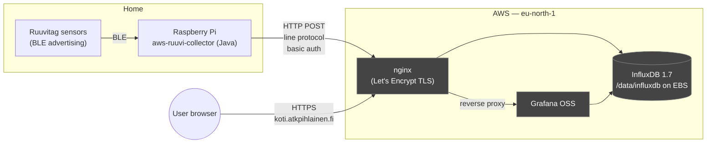
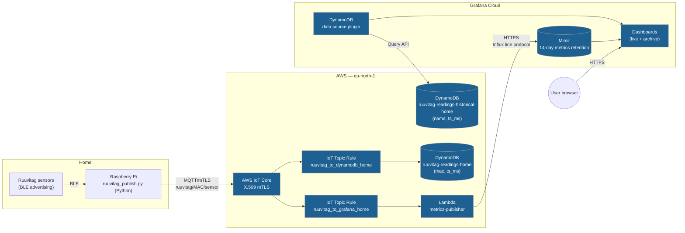

# Architecture

Ruuvitag-serverless replaces a single-VM home IoT pipeline with managed
AWS services and Grafana Cloud. This document compares the legacy
setup with the target one and explains the trade-offs.

## Legacy architecture

A long-running EC2 t3.micro hosting InfluxDB 1.7 and Grafana, behind
nginx with a Let's Encrypt cert. The Raspberry Pi at home runs an old
Java service (`aws-ruuvi-collector`) that reads Bluetooth Low Energy
advertisements from Ruuvitag sensors and posts them as InfluxDB line
protocol over HTTP. Authentication is HTTP Basic with a long-lived
shared password.

Cost: ~$15/month — see the cost breakdown below. One VM to patch,
back up, restart. InfluxDB port exposed on the public internet behind
HTTP basic auth — workable but not ideal. Backups are `aws ec2
create-snapshot` on the EBS volume.

## Target architecture

The Pi is the only on-prem component; everything else is managed.
A new Python publisher pushes via MQTT over mTLS into AWS IoT Core.
A single Topic Rule fans the message to two destinations: DynamoDB
for archival storage, and a Lambda that forwards it to Grafana Cloud
Mimir for fast dashboarding.

Cost: ~$1.70/month — see the cost breakdown below.

## What changed and why

| Concern | Legacy | Target | Why |
|---|---|---|---|
| Compute | EC2 t3.micro 24/7 | None on EC2 (Lambda only when message arrives) | No instance to patch, restart, reboot. Eliminates failure mode where a burst kills sshd. |
| Storage | InfluxDB on EBS | DynamoDB (live + archive) | Managed, encrypted at rest, point-in-time recovery, no capacity planning. |
| Authentication | HTTP basic with shared password | X.509 mTLS per device | Per-device certs revocable independently. No password to leak. |
| Public exposure | nginx + InfluxDB ports on public IPv4 | IoT Core endpoint with cert auth, no inbound from device side | Reduces attack surface to AWS-managed entry point. |
| Time-series queries | InfluxQL via Grafana | PromQL via Grafana Cloud Mimir for live, DynamoDB plugin for archive | InfluxQL → PromQL conversion is one-time work; afterwards PromQL panels are nicer to build. |
| Backup | EBS snapshots, manual | DynamoDB on-demand has continuous backups built in; archive table is read-only after import | One less thing to remember. |
| Migration of historical data | n/a | One-shot S3 Import on a downsampled 1-min export (~$0.50) | Six years of readings preserved without keeping the EC2 alive. |

## Cost breakdown

Both numbers below assume current usage: 3 sensors publishing one
reading per minute, ~131,400 messages per month.

### Legacy — ~$15/month

| Component                          |  Cost  |
|------------------------------------|--------|
| EC2 t3.micro, 24/7                 | ~$8.50 |
| EBS gp2, 30 GB                     |  ~$3.00 |
| Public IPv4 (since Feb 2024)       |  ~$3.65 |
| Data transfer out                  |  ~$0.10 |
| Route 53 hosted zone               |  ~$0.50 |
| **Total**                          | **~$15.75** |

The two biggest items are fixed: compute (regardless of how much data
the Pi pushes) and the public IPv4 address. The setup pays the same
price for one sensor as for fifty.

### Target — ~$1.70/month

| Component                                            |  Cost  |
|------------------------------------------------------|--------|
| Lambda invocations + GB-seconds                      |   $0   | (1M req/mo + 400k GB-s/mo always-free; we use 131k req + 15k GB-s) |
| CloudWatch Logs                                      |   $0   | (5 GB/mo always-free; we use ~60 MB) |
| IoT Core — connection minutes                        | $0.004 | (1 device × 43,800 min × $0.08/M-min) |
| IoT Core — messaging                                 | $0.13  | (131k msg × $1/M, 5 KB tier) |
| IoT Core — rule executions                           | $0.04  | (2 rules × 131k = 263k × $0.15/M) |
| DynamoDB live writes                                 | $0.16  | (131k WRU × $1.25/M) |
| DynamoDB live storage                                | $0.03  | (~100 MB/year × $0.25/GB-mo) |
| DynamoDB historical storage                          | $0.33  | (~1.3 GB × $0.25/GB-mo) |
| S3 migration bucket                                  | $0.005 | (200 MB, lifecycle expires after 30 days) |
| KMS — Terraform state encryption (1 customer key)    | $1.00  | (flat per CMK) |
| Grafana Cloud Free                                   |   $0   | (21 series, 14-day retention; we are well under the 10k series cap) |
| **Total**                                            | **~$1.70** |

The single biggest line is the KMS customer-managed key for Terraform
state encryption — $1/month flat. Dropping that to S3-default AES256
would shave the bill to ~$0.70/month at the cost of losing per-key
audit and rotation. Kept for now because the cost is small and the
audit trail is useful.

### Why "Lambda runs continuously" doesn't actually cost anything

Lambda is only billed for active execution — it does not run idle. At
this volume:

- 131,400 invocations × ~900 ms each = ~32.8 hours of compute per month
- An EC2 t3.micro that's "running" charges for 730 hours per month
- Lambda is billed in 1-millisecond increments above a 1 ms minimum
- The first 1M requests + 400k GB-seconds per month are always-free

So even though Lambda is conceptually "always on" (it responds to
every IoT message instantly), the meter only ticks during the ~1
second per minute when it is actually running code.

### How the bill scales

The legacy stack is flat: same monthly cost whether you have one
sensor or fifty. The target stack scales linearly with volume because
every per-message charge (IoT messaging, rule executions, DynamoDB
writes) is proportional to message count.

| Sensors | Legacy | Target |
|---------|--------|--------|
|   3     | ~$15   | ~$1.70 |
|  10     | ~$15   | ~$2.20 |
|  50     | ~$15   | ~$5.00 |
|  100    | ~$15-30 (t3.micro starts struggling) | ~$8.00 |

The crossover is somewhere around 200-300 sensors, well outside what
this home setup needs.

## Why split DynamoDB and Mimir for live data

The legacy stack used InfluxDB for both long-term storage *and* the
query backend Grafana hit. The target splits them deliberately:

- **DynamoDB** is cheap to keep data in for years (~$0.25/GB/month)
  but its query API doesn't aggregate — every "average over the last
  hour, grouped by sensor" panel would have to scan rows and reduce
  client-side.
- **Mimir** is built for those time-series aggregations. Free tier
  retention is 14 days, which is plenty for "live" panels but doesn't
  cover the multi-year history.

So both: live data goes to Mimir for dashboarding *and* DynamoDB for
archive. Anything older than 14 days is queryable only from DynamoDB,
via the archive dashboard.

## What's not in this picture

- The bootstrap Terraform stack (S3 + DynamoDB lock + KMS for state)
  in `bootstrap/`. It exists to manage the rest of the stack but
  doesn't move data.
- The migration S3 bucket (`ruuvitag-migration-<account>`) and the
  one-shot `scripts/migrate_influx_to_s3.py`. Both are gone after the
  archive table is verified — the bucket lifecycle expires its
  contents in 30 days.
- The legacy nginx + Let's Encrypt + Grafana OSS stack. Gone after
  EC2 is decommissioned.
